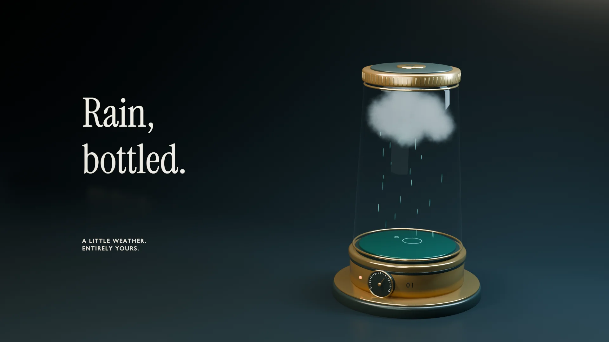

# SlopCamera

[](https://slopcamera.com/docs/how-to/remix-the-showcase#rain-bottled)

**A multimedia studio for your coding agent.** SlopCamera lets your coding
agent make images, diagrams, animation, 3D scenes, and video from source files
it can keep revising. Use it with Codex, Claude Code, or another coding agent.
Direct the style, timing, camera, and sound, then refine the result.

Your agent writes the scene or edit as source. SlopCamera renders it with the
appropriate engine and keeps the inputs so the agent can change a shot,
rework a composition, or deliver another format. Combine authored scenes,
generated media, and your own footage in the same project.

[Watch the films](https://slopcamera.com/#examples) · [Install](#install-slopcamera) · [Direct a film](https://slopcamera.com/docs/how-to/direct-a-film) · [Docs](https://slopcamera.com/docs) · [GitHub examples](examples/showcase)

## What you can make

- **Films and animation.** Author motion graphics, illustrated scenes, and
  native Blender shots. Control camera, materials, lighting, and timing.
- **Visual explanations.** Make diagrams and educational films with editable
  labels, mathematics, narration, and graphics.
- **Images and designs.** Create illustrations, trace raster artwork to SVG,
  or revise a parametric architectural model.
- **Edits of your footage.** Compose shots, sound, overlays, and captions,
  then export horizontal, vertical, square, or portrait versions.

The [techniques catalog](https://slopcamera.com/docs/reference/techniques)
connects each job to its supported commands and requirements. SlopCamera is
free and open source. Local editing and rendering need no SlopCamera account.
Generation uses your own Vercel AI Gateway account, or prepaid Hraness Credits
for prompt-only hosted images; model usage is billed separately.

## Install SlopCamera

Install [Bun 1.3.14 or newer](https://bun.sh), then install the
[SlopCamera v3.10.0 release](https://github.com/hraness/slopcamera/releases/tag/v3.10.0)
and its matching Agent Skill:

```sh
bun add --global https://github.com/hraness/slopcamera/releases/download/v3.10.0/hraness-slopcamera-3.10.0.tgz
slopcamera skill install --target agents
```

The `agents` target works for agents that read `~/.agents/skills`. Use
`--target claude` for Claude Code, or omit the target for Codex. Add `--scope project`
inside a repository for a project-only install. Start a new
agent session so it loads the skill, then ask for a result:

> Make a short illustrated film of a late-night tram whose destination
> changes to the moon. Give it warm windows, a rainy city, and a quiet ending.
> Start with a frame and a motion test so we can direct it before the final
> render. Keep the source and sound editable.

Setup guides: [Claude Code](https://slopcamera.com/docs/tutorials/claude-code) ·
[Codex](https://slopcamera.com/docs/tutorials/codex) ·
[Other agents](https://slopcamera.com/docs/tutorials/other-agents) ·
[MCP clients](https://slopcamera.com/docs/tutorials/mcp). Native engines such as
Blender install separately; the
[capability reference](docs/reference/capabilities.md) lists what each
technique needs.

On macOS, start with [your first animation](https://slopcamera.com/docs/tutorials/first-animation)
for a supplied scene you can render and revise without a model account. It
needs the browser and FFmpeg runtimes reported by `slopcamera doctor --json`.
For a first result on macOS, Linux, or Windows with no browser or paid model,
follow [your first diagram](https://slopcamera.com/docs/tutorials/first-diagram).
The [directing guide](docs/how-to/direct-a-film.md) explains how to ask for useful
changes to composition, timing, camera, and sound.

<details>
<summary>Build from source</summary>

Install Git as well, then use a new checkout:

```sh
git clone --branch main https://github.com/hraness/slopcamera.git slopcamera-source
cd slopcamera-source
git rev-parse HEAD > ../slopcamera-source-commit.txt
bun install --frozen-lockfile --ignore-scripts
bun run build:sdk
bun run build:desktop:cli
```

Keep the checkout and recorded commit. In this shell, define the command
against that exact build:

```sh
export SLOPCAMERA_SOURCE_ROOT="$PWD"
slopcamera() { bun "$SLOPCAMERA_SOURCE_ROOT/apps/desktop/dist/cli/main.js" "$@"; }
slopcamera --help
slopcamera doctor --json
slopcamera skill install --target agents
```

The skill comes from the same checkout as the CLI. In a later shell, restore
the checkout path and function. The
[source-install guide](docs/how-to/use-current-source.md) covers workspace
placement and resuming long runs.

</details>

CLI updates in SlopCamera 3.10.0 and newer are enabled by default for supported
Bun and npm global installations. See [update controls](docs/reference/capabilities.md#cli-updates)
to keep a version or check for a release.

## Make a film. Then direct it again.

[Last tram to the moon](https://slopcamera.com/docs/tutorials/first-animation)
is a complete first project: original illustrated artwork, a twelve-second
journey, and a visible revision. The tutorial renders locally without a model
account or downloaded artwork.

The two supplied render requests use the same scene. The first sets the city
and departure; the second enlarges the moon while keeping the journey, palette,
and timing. Ask your agent:

> Make the moon dominate the destination. Preserve the copper tram and rainy
> city. Keep both versions so I can compare their endings.

[Follow the animation tutorial](https://slopcamera.com/docs/tutorials/first-animation),
then [remix the showcase](https://slopcamera.com/docs/how-to/remix-the-showcase):
a bottled storm, a paper ocean, a dancing laundromat, a band of harmonics,
and three edits of the same eclipse footage. Each piece has source,
production instructions, and a suggested creative revision.

For a smaller first task, [make a diagram](https://slopcamera.com/docs/tutorials/first-diagram)
and export its editable tldraw document, light and dark SVGs, and PNGs.

## What SlopCamera does

Each technique pairs a short source file the agent writes with commands that
render and check it. The
[techniques reference](https://slopcamera.com/docs/reference/techniques) lists
them all with their requirements.

| Technique | The agent writes | SlopCamera renders | Example |
| --- | --- | --- | --- |
| Diagrams | Diagram JSON | `.tldr`, light and dark SVG and PNG, after a strict check | [Pipeline](https://slopcamera.com/docs/tutorials/first-diagram#stack-layout) |
| Vector tracing | A path to a raster image | SVG traced locally with VTracer (macOS and Linux) | [Color and duotone](https://slopcamera.com/docs/how-to/vectorize-images#inspect-a-reproducible-example) |
| Motion graphics | An HTML scene in one of seven profiles: plain, Motion, p5, Two, Paper Shaders, Three.js, vgpu (WGSL) | H.264 MP4 with optional local audio | [Kinetic type](https://slopcamera.com/docs/how-to/render-motion-graphics#animate-type-with-motion) |
| Music-timed motion | An HTML scene, a local track, and its tempo in BPM | Motion timed to the declared tempo; beats are not detected from the audio | [Island Pulse](https://slopcamera.com/docs/how-to/music-video#inspect-the-island-example) |
| 3D scenes | Scene JSON with parts, media, and named cameras | Stills, contact sheets, and video, with orbit, dolly, crane, and rail moves | [Camera orbit](https://slopcamera.com/docs/how-to/direct-scenes#orbit-around-live-media) |
| Parametric design | Named dimensions and constraints | Geometry and a scene you can re-render at new sizes | [Pavilion](https://slopcamera.com/docs/how-to/parametric-design#crescent-pavilion) |
| Native films | A Blender, CadQuery, or Manim program from a starter | Frames and video from your installed engines | [Product film](https://slopcamera.com/docs/tutorials/first-native-film#inspect-the-finished-example) |
| Explainer video | A Manim scene, captions, and a presenter | A lesson video with typeset math | [Geometry lesson](https://slopcamera.com/docs/how-to/educational-video#inspect-the-finished-example) |
| Footage edits | Cuts, captions, reframes, and color as project decisions | 16:9, 9:16, 1:1, and 4:5 exports from one edit | [Four formats](https://slopcamera.com/docs/how-to/edit-video#landscape-delivery) |

SlopCamera also composes vector icon scenes with the bundled icon.place library
and reads Soundfish scores or MIDI files into beat grids for music-timed scenes,
both locally and without a model. Neither renders audio.

Model-backed generation of images, video, and speech is available through your
own provider access, and cinematic effects, particles, and character
performance can be planned from source. The gallery has no rendered examples
of these yet.

### Film native worlds and educational animation

SlopCamera can direct Blender for sets, materials, lighting, skinned
characters, cloth, and liquid caches; CadQuery for parametric solids and STEP;
and Manim Community for mathematical animation. Seven editable starters
include a product, character, shaded street, cloth, liquid, CAD bracket, and
educational presenter. Watch the
[Rain, bottled](https://slopcamera.com/docs/how-to/remix-the-showcase#rain-bottled),
then change its [weather, materials, and camera](examples/showcase/studio-relaunch/rain-bottled).
For 2D motion, try the
[illustrated tram film](https://slopcamera.com/docs/tutorials/first-animation).
The [portrait geometry lesson](https://slopcamera.com/docs/how-to/educational-video)
adds mathematical typesetting, a presenter, and captions.

Native source runs as the current user. Blender and Python environments install
separately, and native
source execution requires explicit current-user trust. See [Native film studio](docs/studio.md)
for the starters and engine requirements.

### Generate media

Discover image, video, speech, and transcription models through your own
Vercel AI Gateway access, with `AI_GATEWAY_API_KEY` set in the local process
environment. Generate images from text and references, add a voiceover,
transcribe sound, or create short video shots. Availability and pricing come
from the live model catalog. Without a Gateway key, prepaid Hraness Credits
run prompt-only image generation through the hosted API
(`slopcamera ai image generate --hosted`). See
[Generate media](docs/how-to/generate-media.md) and
[Direct short generated clips](docs/directing-video.md).

### Edit footage and deliver finished videos

Import existing footage or recording bundles. Remove pauses and filler words,
align sound, reframe speakers, zoom into screen actions, and add captions,
graphics, color, and audio treatment. Preview a candidate, then export clean
and captioned versions in each format from the same edit.

> Edit my product demo: cut the pauses, zoom into each important click, keep
> the speaker framed, add captions and `logo.svg`, and show a preview before
> export.

SlopCamera edits recordings you already have; it does not record the screen,
camera, or microphone.
Standalone media imports need an existing project; `html render`, `studio assemble`,
or `direct assemble` can create one. Read [`PRIVACY.md`](PRIVACY.md) before
editing sensitive material. Eight built-in workflows package common jobs such as
social cuts and talking-head cleanup:

```sh
slopcamera workflows list --json
slopcamera workflows show social-variants --json
```

Start with [Edit a video](docs/how-to/edit-video.md) or
[Run workflows](docs/how-to/run-workflows.md).

## How SlopCamera works

Each kind of work keeps its own source file. A native scene holds a rig or
simulation; a portable scene holds geometry, cameras, and media placement; a
diagram holds its shapes and labels; a video project holds cuts and delivery
settings. SlopCamera connects them through files: a rendered diagram can
appear on a screen in a 3D scene, and native frames can become a clip in a
video project.

1. **Prepare the sources.** Import footage and assets, or author a scene,
   diagram, or native program from a starter.
2. **Direct the result.** Name cameras, shots, timing, composition, and output
   settings. Generate missing media only when the job calls for it.
3. **Review a render.** Inspect contact frames, motion, captions, sound, and
   continuity, then select the version to keep.
4. **Deliver and revise.** Export the formats you need. The sources and
   project decisions stay in place for the next change.

The same system is available four ways: the Bun CLI, the TypeScript SDK, the
Agent Skill, and an MCP server (`slopcamera mcp`) with a smaller fixed toolset.

### Instructions for coding agents

Read local project instructions and inspect sources before changing them. Use
`slopcamera --help`, `slopcamera doctor --json`,
`slopcamera operations list --json`, and the installed skill to discover the
exact local commands. Agree on output requirements, preview substantial
changes, inspect the resulting files, and report their paths. A successful
plan does not show that provider access, native trust, or model quality is in
place.

## Compared with other tools

Details as of 28 September 2026.

| | Agent writes | License | Cloud rendering | Choose it when |
| --- | --- | --- | --- | --- |
| SlopCamera | Diagram JSON, HTML scenes, scene JSON, Blender, CadQuery, or Manim programs, and video edits | MIT | Video renders on your machine; a hosted API checks and renders diagrams and generates images | One agent needs diagrams, 3D, native films, and footage edits in one local project |
| [Remotion](https://www.remotion.dev/) | React components | Source-available; free for individuals, non-profits, and organizations of up to 3 people | AWS Lambda in your account | Your team writes React and renders at scale |
| [HyperFrames](https://github.com/heygen-com/hyperframes) | HTML, CSS, and JavaScript animation | Apache 2.0 | HeyGen-hosted rendering or AWS Lambda | You want HTML motion graphics rendered to MP4 |

Remotion and HyperFrames have much larger communities. For a one-off image or
clip, a hosted app needs no install. Read
[SlopCamera vs Remotion](https://slopcamera.com/docs/explanation/slopcamera-vs-remotion),
[SlopCamera vs HyperFrames](https://slopcamera.com/docs/explanation/slopcamera-vs-hyperframes),
[Remotion alternatives for coding agents](https://slopcamera.com/docs/explanation/remotion-alternatives-for-coding-agents),
or [Why SlopCamera](https://slopcamera.com/docs/explanation/why-slopcamera).

## Important limitations

- **Runtime support varies.** The CLI runs with Bun on macOS, Linux, and Windows.
  Media, browser, GPU, and native studio profiles
  need additional software, and vector tracing does not run on Windows. Run
  `slopcamera doctor` and see the capability reference.
- **Checks do not judge quality.** A passing check or finished render shows
  that the job ran, not that the result looks right. Models may also change a
  subject's identity, motion, or text; review generated media.
- **Interchange keeps a supported subset.** Exporting a GLB does not turn a
  native rig or simulation into an editable scene. An image or video on a
  plane supplies pixels, not geometry.
- **Pixels can differ across machines.** Native tools, codecs, GPU drivers, and
  provider models affect results, so the same source does not promise
  identical output elsewhere.
- **Trusted code is not sandboxed.** Native Python and your own Bun workflows
  run with the current user's access.
- **MCP is a subset.** Its 21 fixed tools check and render diagrams, plan and
  audit scenes, compose icon scenes and soundtrack beat grids, and run ten
  operation codes. It does not expose every CLI command and never changes
  project state.

## Design and trust

There is no SlopCamera account or hosted project database. Video editing and
rendering run on your machine; the optional hosted API checks and renders
diagrams and generates images. Gateway generation and cloud
analysis use credentials from the local process and ask for your
acknowledgement before uploading named media. The optional hosted image API
runs each paid call in a short-lived workspace against a Hraness Credits device
token and keeps no credentials or projects; the token lives in owner-only files
and never appears in command arguments or operation records. The website never accepts a Gateway
credential.

Native Python requires separate authorization. Custom Bun workflow modules run
when loaded, including during check and plan, so review their source first.
Both run with the current user's access, including network access. Normal edit
operations leave original media unchanged, and important operations record
their inputs and outputs.

Read [Architecture](docs/architecture.md), [`SECURITY.md`](SECURITY.md),
[`PRIVACY.md`](PRIVACY.md), and [`NOTICE.md`](NOTICE.md) for details. Keeping
the source beside the result is the design every Hraness project shares; [The
thread through hraness](https://hraness.com/writing/the-thread-through-hraness)
follows it across projects, and the [ALGAL
vision](https://algal.computer/docs/vision/) states the bet behind it.

## Documentation

- **Learn:** [Your first diagram](docs/tutorials/first-diagram.md) · [Your first native film](docs/tutorials/first-native-film.md).
- **Make a result:** [Edit video](docs/how-to/edit-video.md) · [Generate media](docs/how-to/generate-media.md) · [Run workflows](docs/how-to/run-workflows.md) · [Educational video](docs/how-to/educational-video.md) · [Plan camera moves, lighting, and effects for a 3D scene](docs/how-to/direct-cinematic-worlds.md) · [Direct visual styles](docs/how-to/direct-visual-styles.md).
- **Look up support:** [Techniques](https://slopcamera.com/docs/reference/techniques) · [Capabilities](docs/reference/capabilities.md) · [SDK entrypoints](docs/reference/sdk.md) · [Creative tools](docs/html-overlay-creative-toolkit.md).
- **Understand the system:** [Architecture](docs/architecture.md) · [Native studio](docs/studio.md) · [Directed scenes](docs/spatial-scenes.md) · [Extension architecture](docs/extension-architecture.md).

The [documentation index](docs/README.md) connects these paths, and
[slopcamera.com/docs](https://slopcamera.com/docs) publishes them.

### Use the SDK

Run this example with Bun from the source checkout after `bun run build:sdk`.
SDK imports do not start the CLI or read local project state. For example,
convert an existing local image into an SVG:

```ts
import { vectorizeImage } from "@hraness/slopcamera"

const result = await vectorizeImage("logo.png", { outputPath: "logo.svg" })
console.log(result.receipt.sourceSha256, result.receipt.svgSha256)
```

Use `@hraness/slopcamera/code` for declarative workflow graphs,
`@hraness/slopcamera/workflow` for trusted Bun workflows, and
`@hraness/slopcamera/local/*` for the local media engine. See the
[SDK reference](docs/reference/sdk.md).

## Verification

```sh
bun install --frozen-lockfile --ignore-scripts
bun run check
```

The check covers the public SDK, the local runtime, schemas, the Agent Skill,
generated entrypoints, the website, deterministic and property tests, and
installs of the packed package. Native engines and model providers need their
own runs on real hardware and accounts; a local test pass does not cover them.
See [`CONTRIBUTING.md`](CONTRIBUTING.md) for every check.

## Contributing

Read [`CONTRIBUTING.md`](CONTRIBUTING.md) and the nearest `AGENTS.md` before
changing a package or runtime boundary. Report vulnerabilities through
[`SECURITY.md`](SECURITY.md).

## License

[MIT](LICENSE), with third-party notices in [`NOTICE.md`](NOTICE.md).

## Optional support

Every feature works without payment. `slopcamera support` shows an optional way
to support development and opens no browser. `support dismiss` opts out across
the local suite, `support snooze` pauses the notice for 30 days, and
`HRANESS_SUPPORT_AUDIENCE=off` disables ambient notices. Agents follow the
[support reference](skills/slopcamera/references/support.md).

## Former name

<details>
<summary>Historical Atet release evidence</summary>

SlopCamera was called Atet until September 2026.
[Atet v3.2.3](https://github.com/hraness/atet/releases/tag/v3.2.3) and its
[original archive](https://github.com/hraness/atet/releases/download/v3.2.3/hraness-atet-3.2.3.tgz)
still install Atet, not SlopCamera.

</details>
